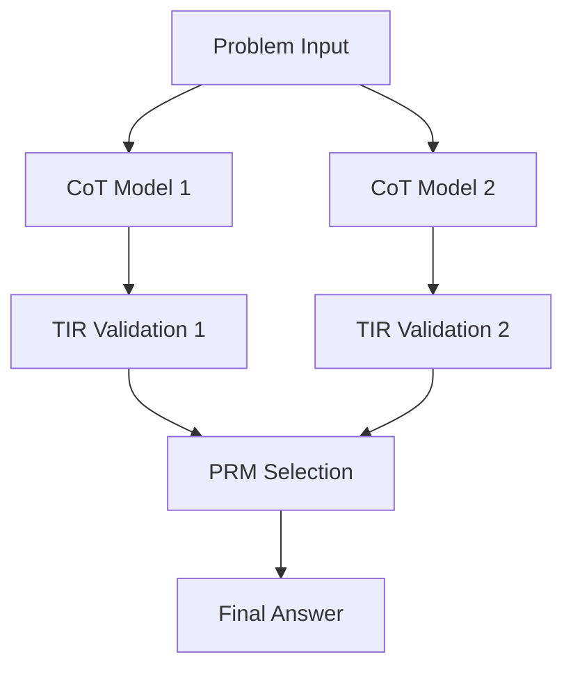

# The FantIAstic Four Project


**An AI-powered mathematical problem-solving system for the AIMO 2 competition.**

The Fantastic Four Project is a cutting-edge AI system designed to solve complex mathematical problems with precision and clarity. Leveraging the collaborative power of four specialized AI models, it generates, validates, and selects the best solutions to challenges posed in the AI Mathematical Olympiad - Progress Prize 2 (AIMO 2). This project combines innovation, scalability, and transparency to push the boundaries of AI-driven mathematics.

---

## Table of Contents

- [Project Overview](#project-overview)
- [Features](#features)
- [How It Works](#how-it-works)
- [Installation and Setup](#installation-and-setup)
- [Usage](#usage)
- [Contributing](#contributing)
- [License](#license)
- [Acknowledgments](#acknowledgments)

---

## Project Overview

The AI Mathematical Olympiad - Progress Prize 2 (AIMO 2) challenges participants to develop AI models capable of solving mathematical problems at the level of national olympiads. The Fantastic Four Project rises to this challenge with a groundbreaking multi-model architecture, uniting the strengths of four distinct AI components:

- **Two Chain of Thought (CoT) Models**: Generate detailed, step-by-step solutions to mathematical problems.
- **One Validation Model (TIR)**: Rigorously verifies the correctness of each solution.
- **One Selection Model (PRM)**: Chooses the most accurate and clearest solution from the candidates.

This collaborative system ensures both precision and comprehensibility, making it a standout contender in the AIMO 2 competition. Whether you're a developer, researcher, or math enthusiast, this project offers a glimpse into the future of AI-powered problem-solving.

---

## Features

- **Multi-Model Collaboration**: Harnesses the power of four AI models to generate, validate, and select the best solution.
- **Chain of Thought Reasoning**: Delivers transparent, step-by-step solutions for better understanding and insight.
- **Rigorous Validation**: Ensures solution accuracy through a dedicated validation model.
- **Optimized for AIMO 2**: Tailored to excel in the AI Mathematical Olympiad - Progress Prize 2 challenges.
- **Scalable Architecture**: Built to perform efficiently across multiple GPUs for maximum throughput.

---

## How It Works

The Fantastic Four Project operates through a seamless, five-step workflow:

1. **Problem Input**: A mathematical problem is fed into the system.
2. **Solution Generation**: Two CoT models independently craft detailed solutions.
3. **Validation**: The TIR model evaluates each solution for correctness.
4. **Selection**: The PRM model picks the best solution based on accuracy and clarity.
5. **Output**: The final, polished answer is presented.

Here’s a visual representation of the process:



This architecture ensures that every solution is not only correct but also elegantly explained, aligning with the goals of the AIMO 2 competition.

## Installation and Setup

### Requirements

- **Python**: 3.8 or higher
- **PyTorch**: 1.10 or higher
- **Transformers**: 4.20 or higher
- **BitsAndBytes**: For model quantization
- **Hardware**: 4 NVIDIA L4 GPUs (or equivalent)

### Installation Steps

1. **Clone the Repository**  
   Get started by cloning the project to your local machine:
   ```bash
   git clone https://github.com/yourusername/fantastic-four-project.git
   cd fantastic-four-project
   ```
2. **Model Access**
   
   Ensure you have access to the following Hugging Face models:
   - Qwen/Qwen2.5-Math-7B-Instruct
   - Qwen/Qwen2.5-Coder-7B-Instruct
   - Qwen/Qwen2.5-Math-PRM-7B
     
   Note: This project is optimized for high-performance hardware. Ensure your setup meets the GPU requirements for the best experience.

## Usage

### Local Testing

Test the project locally with a simple Python script:

```python
from fantastic_four import solve_problem

problem = "Find the sum of all prime numbers less than 10."
answer = solve_problem(problem)
print(f"The answer is: {answer}")
```

### Sample Output

Here’s what you might see when running the above example:

```text
  _____ _            _____           _            _   _        _____                
 |_   _| |__   ___  |  ___|_ _ _ __ | |_ __ _ ___| |_(_) ___  |  ___|__  _   _ _ __ 
   | | | '_ \ / _ \ | |_ / _` | '_ \| __/ _` / __| __| |/ __| | |_ / _ \| | | | '__|
   | | | | | |  __/ |  _| (_| | | | | || (_| \__ \ |_| | (__  |  _| (_) | |_| | |   
   |_| |_| |_|\___| |_|  \__,_|_| |_|\__\__,_|___/\__|_|\___| |_|  \___/ \__,_|_|   
                                                                                    

Solving problem: Find the sum of all prime numbers less than 10.

Melhor Solução:
To solve this problem, we need to find all prime numbers less than 10 and sum them up.

First, let's list all the prime numbers less than 10:
- 2 (the smallest prime number)
- 3
- 5
- 7

Now, we add these numbers together:
2 + 3 = 5
5 + 5 = 10
10 + 7 = 17

Therefore, the sum of all prime numbers less than 10 is 17.

Validation: VALID
Explanation: The solution correctly identifies the primes and calculates their sum.

Resposta Final: 17
```

### Competition Submission

To submit to the AIMO 2 competition:

- Set up your notebook with the inference server as outlined in the AIMO 2 Submission Demo.
- Integrate your predict function with the server.
- Submit your notebook to Kaggle for evaluation.

## Contributing

We welcome contributions to make the Fantastic Four Project even better! Here’s how to get involved:

1. **Fork the Repository**: Create your own copy of the project.
2. **Create a Branch**: Work on your feature or fix in a new branch.
   ```bash
   git checkout -b feature/your-feature-name
   ```
3. Commit Changes: Use clear, descriptive commit messages.
4. Push Your Branch: Share your work with the world
   ```
   git push origin feature/your-feature-name
   ```
5. Open a Pull Request: Submit your changes for review.

Please ensure your contributions align with the project’s coding standards and include relevant tests.

## License

This project is licensed under the MIT License. See the  file for full details.

## Acknowledgments

- Qwen Team: For creating the powerful Qwen models that drive this project.
- AIMO 2 Organizers: For inspiring innovation at the intersection of AI and mathematics.
- Open-Source Community: For providing invaluable tools like Transformers and PyTorch.
